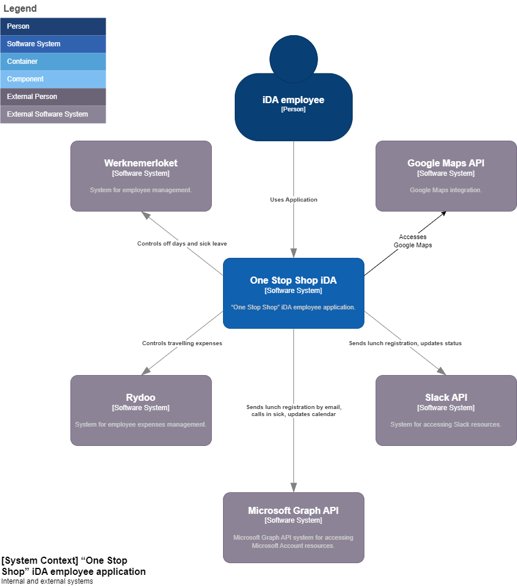
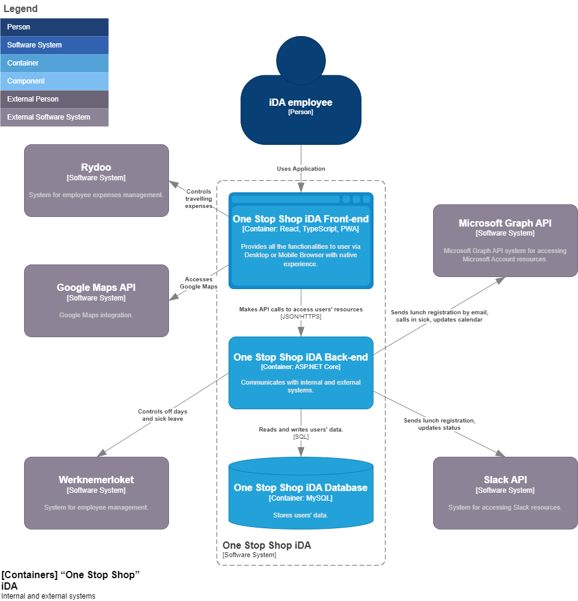
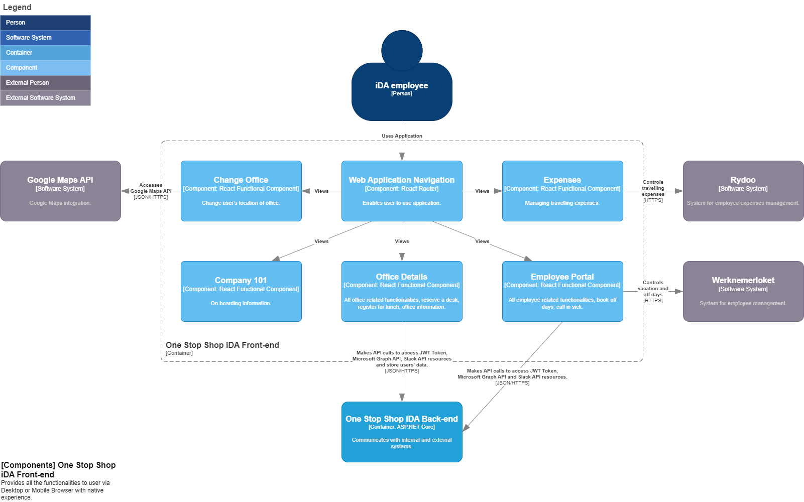
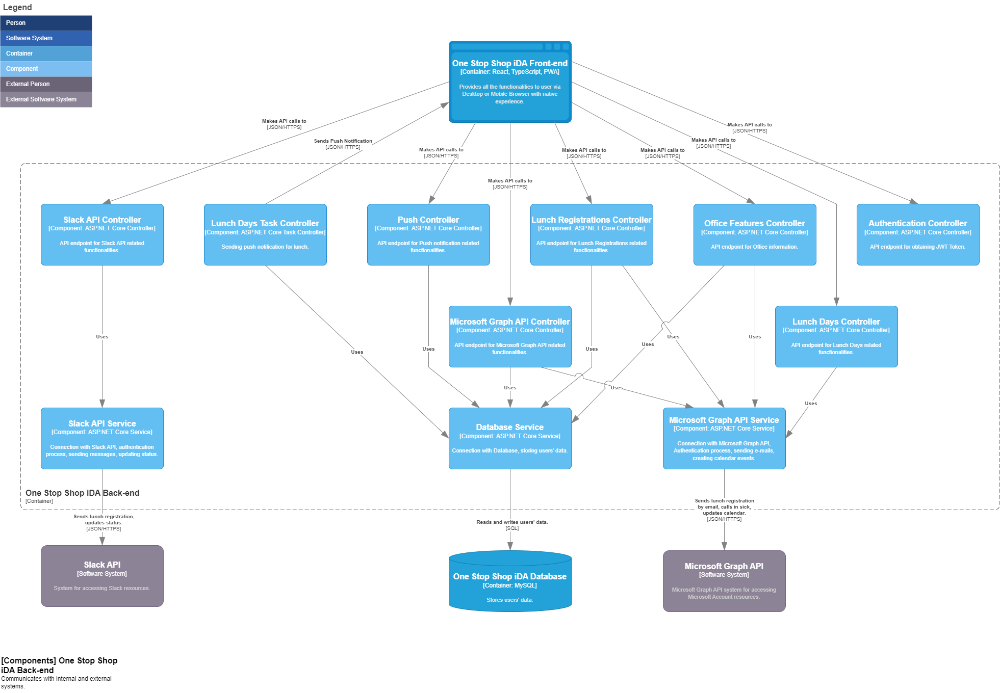

# “One Stop Shop” iDA workplace management application

A workplace management application designed to streamline iDA employees' tasks and enhance collaboration.

## Table of Contents

- [“One Stop Shop” iDA workplace management application](#one-stop-shop-ida-workplace-management-application)
  - [Table of Contents](#table-of-contents)
  - [About the Project](#about-the-project)
  - [Features](#features)
  - [Technologies Used](#technologies-used)
    - [Frontend](#frontend)
    - [Backend](#backend)
  - [Software Architecture](#software-architecture)
    - [C4 Model Diagrams](#c4-model-diagrams)
      - [C4 Level 1](#c4-level-1)
      - [C4 Level 2](#c4-level-2)
      - [C4 Level 3](#c4-level-3)
  - [Project Structure](#project-structure)
    - [Branches](#branches)
    - [Directory Structure](#directory-structure)
  - [Setup and Installation](#setup-and-installation)
    - [Frontend](#frontend-1)
    - [Backend](#backend-1)
  - [Usage](#usage)
  - [Contributors](#contributors)

## About the Project

**Course:** Internship

**Semester:** 5

The "One Stop Shop" application was developed during the Semester 5 internship program. Its purpose is to provide employees at iDA with a centralized platform to manage various workplace tasks, simplify communication, and enhance collaboration. The application integrates multiple tools and services into one interface, enabling employees to focus on their work without the hassle of switching between different platforms.

## Features

- Integration with Microsoft 365 and Slack
- OAuth2.0 Integration
- Unit and End-to-End Testing
- Push Notifications
- Shortcut to the employee portal (Werknemerloket)
- View balance of off days
- Automatic email notifications for sick leave and return-to-work updates
- Auto-update Slack status for sick leave or return-to-work
- Indicate office presence days
- Reserve desks
- Register for lunch in different offices
- Receive lunch reminders
- Access office details (route, parking, rules, Wi-Fi, etc.)
- Shortcut to the expenses management system

## Technologies Used

### Frontend

- **Programming Languages/Technologies:**
  - React
  - TypeScript
  - HTML
  - CSS
  - Progressive Web App (PWA)
- **Libraries/Frameworks:**
  - React Router
  - Vite
  - Playwright (for testing)

### Backend

- **Programming Languages/Technologies:**
  - C#
  - SQL
- **Libraries/Frameworks:**
  - ASP.NET Core
  - .NET 7.0
  - Entity Framework
  - NUnit
  - MySQL

## Software Architecture

The application follows a 3-Tier Architecture to ensure modularity, scalability, and separation of concerns. The architecture consists of the following layers:

1. _Presentation Layer (**PL**)_: Displays infomation requested by user. **Depends on the BLL Interfaces**
2. _Business Logic Layer (**BLL**)_: Contains all the core business rules and application logic. **No dependencies.**
3. _Data Access Layer (**DAL**)_: Manages data operations directly from various data sources. **Depends on the BLL Interfaces**

```
+---------------------------------------+
|           Presentation Layer          |
|---------------------------------------|
|                                       |
|       Display generated content       |
|                                       |
+---------------------------------------+
                    |
                    |   Dependency Inversion
                    ▼
+---------------------------------------+
|         Business Logic Layer          |
|---------------------------------------|
|                                       |
|    Handles core application rules     |
|                                       |
+---------------------------------------+
                    ▲
                    |   Dependency Inversion
                    |
+---------------------------------------+
|          Data Access Layer            |
|---------------------------------------|
|                                       |
|            Data management            |
|                                       |
+---------------------------------------+
```

### C4 Model Diagrams

#### C4 Level 1



#### C4 Level 2



#### C4 Level 3




## Project Structure

### Branches

Development Branches:

- [frontend](https://github.com/grzgm/one-stop-shop-ida/tree/frontend) - Main Front-end application development.
- [backend](https://github.com/grzgm/one-stop-shop-ida/tree/backend) - Main Back-end application development.

PoC Branches:

- [poc-pwa](https://github.com/grzgm/one-stop-shop-ida/tree/poc-pwa) - Front-end PoC with React, TypeScript, Vite, PWA. Used for testing the React features, PWA implementation, connection with Back-end.
- [poc-microsoft](https://github.com/grzgm/one-stop-shop-ida/tree/poc-microsoft) - Back-end PoC with Node.js, TypeScript, Express server, Microsoft Graph API. Used for testing the Microsoft Graph API service.
- [poc-slack](https://github.com/grzgm/one-stop-shop-ida/tree/poc-slack) - Back-end PoC with Node.js, TypeScript, Express server, Slack API. Used for testing the Slack API service.

### Directory Structure

```
one-stop-shop-ida/
│
├── backend/                        # Source code from backend branch
│   ├── OneStopShopIdaBackend/      # Backend source code
│   │   ├── Controllers/            # BLL Source Code
│   │   │
│   │   ├── Models/                 # BLL Models
│   │   │
│   │   └── Services/               # DAL Source Code
│   │       └── Interfaces/         # Interfaces for External Data Sources
│   │
│   └── TestsNUnit/                 # Unit and End-to-end tests
│
├── frontend/                       # Source code from frontend branch
│   └── src/                        # PL Source Code
│       ├── api/                    # Backend API calls
│       ├── components/             # React components
│       ├── contexts/               # React contexts
│       ├── css/                    # CSS style sheets
│       ├── misc/                   # Helper functions
│       └── routes/                 # React router configruation
│
│
├── documentation/                  # Documentation files for README.md
│
└── README.md                       # Project description
```

## Setup and Installation

Follow the instructions below to set up the project on your local machine.

1. **Clone the Repository**

   ```bash
   git clone https://github.com/grzgm/one-stop-shop-ida.git
   cd one-stop-shop-ida
   ```

   checkout correct branch.

### Frontend

2. **Create Local Environment Variables**

   ```bash
   touch .env.local
   touch .env
   ```

   Add variables:

   - `VITE_GOOGLE_MAPS_API_KEY="your-google-maps-api-key"`,
   - `VITE_VAPID_PUBLIC_KEY = "your-vapid-public-key"`,
   - `VITE_FRONTEND_URI = "your-development-or-production-frontend-uri"`,
   - `VITE_BACKEND_URI = "your-development-or-production-backend-uri"`,

3. **Install Dependencies**

   ```bash
   npm install
   ```

4. **Compile/Build the Project**

   ```bash
   npm run build
   ```

5. **Run the Project**
   ```bash
   npm run dev
   ```

### Backend

2. **Create Local Environment Variables**

   Use Visual Studio or JetBrains Rider to automatically set up nuget packages and dependencies. Create user secrets file that provides environmental variables for the development by following [Documentation Instructions](https://learn.microsoft.com/en-us/aspnet/core/security/app-secrets?view=aspnetcore-7.0&tabs=windows) containing:

   - `Microsoft__MicrosoftClientId`,
   - `Slack__SlackClientId`,
   - `Slack__SlackClientSecret`,
   - `ConnectionStrings__MySqlConnection`,
   - `FrontendUri`,
   - `BackendUri`,
   - `JwtSettings__Secret`,
   - `JwtSettings__Issuer`,
   - `JwtSettings__Audience`,
   - `Vapid__Subject`,
   - `Vapid__PublicKey`,
   - `Vapid__PrivateKey`,
   - `LunchEmailAddress`,
   - `LunchSlackChannel`,

3. **Install Dependencies**

   ```bash
   dotnet restore
   ```

   Project depends on the connection with MySQL Database, Microsoft Entra Application, Slack Application. It is recommended to create two versions of each external service for development and production.

4. **Compile/Build the Project**

   ```bash
   dotnet build
   ```

5. **Run Tests**
   _PlayWright dependencies must be configured._

   ```bash
   dotnet test
   ```

6. **Run the Project**
   ```bash
   dotnet run
   ```

## Usage

- Access the application via the URL provided by the hosting environment.
- Log in using Microsoft 365 iDA account credentials.
- Navigate through the dashboard to:
  - Manage vacations and sick leaves.
  - Register for lunch and check office-specific details (requires Slack log in).
  - Reserve desks and manage your profile.

## Contributors

- [Grzegorz Malisz](https://github.com/grzgm): Author.
